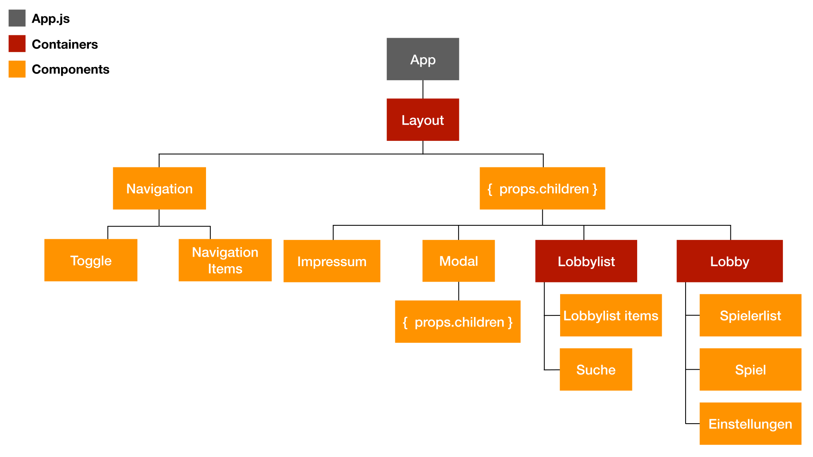

# Cardholder - Website

Dies ist das Repository für die Web Anwendung von Cardholder, mit React.js. Die Anwendung ist im Modul "Full-Stack Development" im Sommersemester 2019 entstanden.

> [Gitmoji](https://gitmoji.carloscuesta.me/) wird für das visuelle Verständnis der Commits verwendet.

## Demo
Eine aktuelle Demo kann [hier](http://ec2-18-185-18-129.eu-central-1.compute.amazonaws.com/) gefunden werden.

## Benutzung
Coming soon...

## Grober Aufbau der Components und Containern

